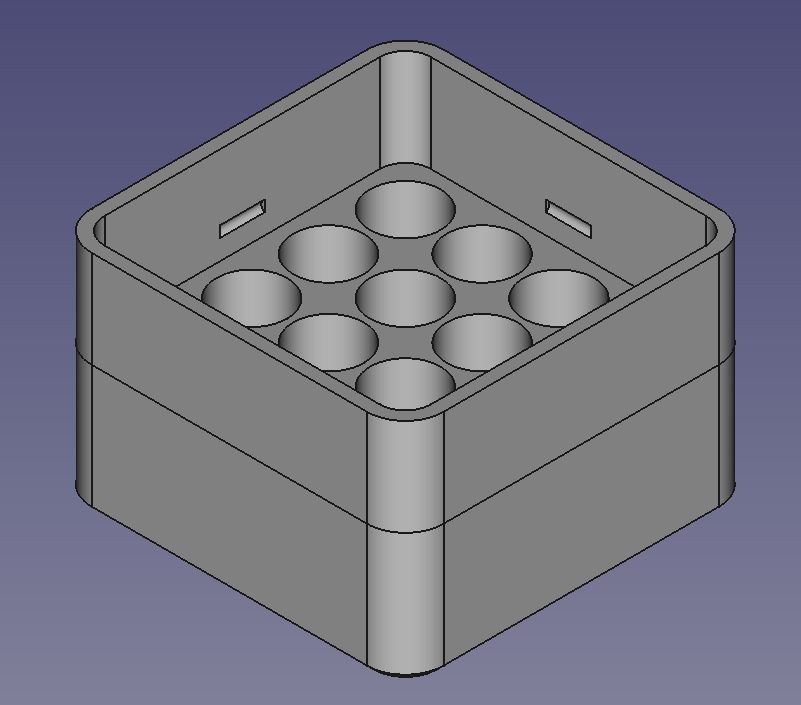
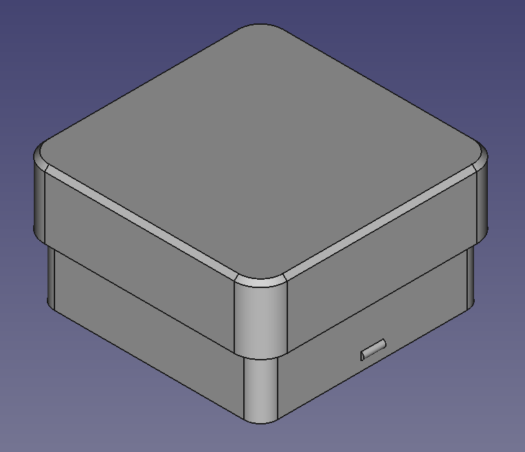

# Battery Box

A box for batteries. Originally designed for AAA batteries.

## Parameters

A lot of parameters can be tweaked in the FreeCAD spreadsheet.

It is easily possible to change the number of rows and columns.

Also, the battery dimension can be changed, which should allow to use this also for
AA or other batteries. However, I never tried that. Let me know if this works.
